# Projecting your data in QGIS 

This tutorial covers three methods for projecting raster datasets and two way for reassigning the CRS in QGIS.

**Table of Contents**

* [Introduction](#introduction)
* [Project Set up](#project-set-up)
* [Reproject Your Data: Two Ways](#reproject-your-data)
	+ [From Raster Tools](#from-raster-tools)
  + [From Toolbox](#from-toolbox)
	+ [By Exporting Layer](#by-exporting-layer)
* [Reassigning the Projection](#reassigning-the-projection)
	+ [From Main Menu](#from-main-menu)
	+ [From Layers Pane](#from-layers-pane)

## Introduction

Most datasets contain geographic data such as a Coordinate Reference System (CRS). Knowing which CRS your data is in helps any GIS software display, measure, and transform your data. Each CRS has its own pros and cons, and here you will learn how to first view the CRS for your data then, how to reproject the layer and save it with the new CRS, which changes the projection properties. Lastly, you will learn how to assign a different CRS to your data, which **does not** reproject, but changes displayed projection of the data. 

## Project Set Up

In order for many GIS functions to work properly, your datasets need to be stored in a common projected coordinate system. This guide will assist you with the projection process in QGIS.  

First, add the data you wish to reproject to the map.  

- From the main menu select Layer -\> Add Layer -\> Add raster layer

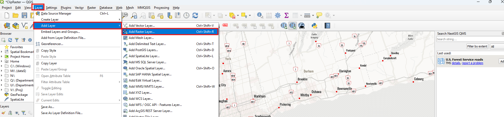

- Browse to where your data is saved, here we used a DEM of GTA that we
  clipped [here.](https://mdlutoronto.github.io/qgis-clipping-rasters/)

- To check the coordinate system for any layer you can right click on
  the layer and choose Properties\...

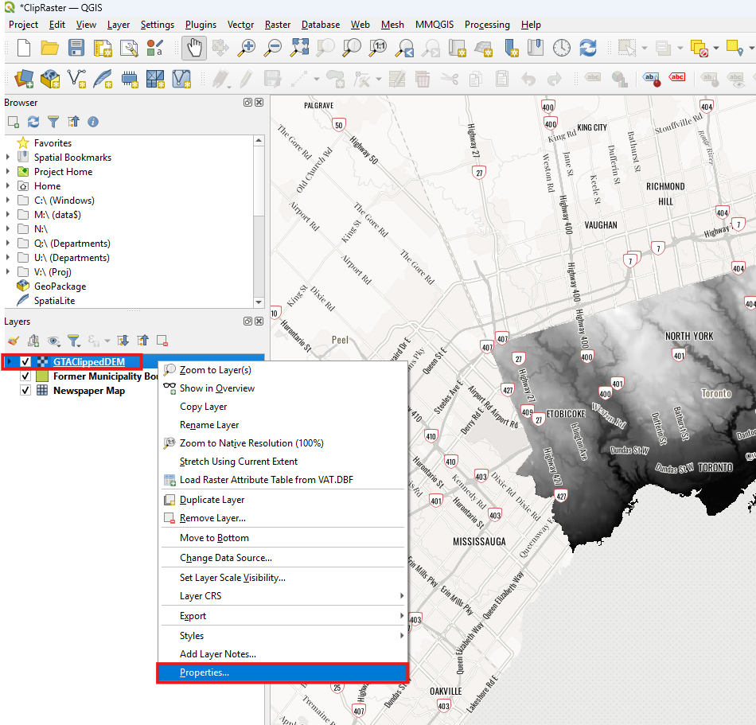

- In the Layer Properties window, click on the Information tab on the
  right-side menu. Scroll down until you see the Coordinate Reference
  System (CRS) section. This layer uses WGS 84 World Mercator
  projection.

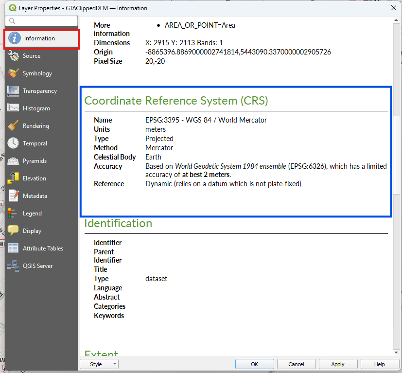

By default, QGIS uses the projection of the first layer, and reproject
each layer you add to the same system as the first layer which is
referred to as "on the fly" projection. Sometimes the first layer does
not have projection information, or you want to change the projection
all together.

## Reproject Your Data

Here we will show different ways to reproject your data, and the method
you select may depend on the type of data you have.

### From Raster Tools

- From the Main Menu, select Raster -\> Projections -\> Wrap (reproject)

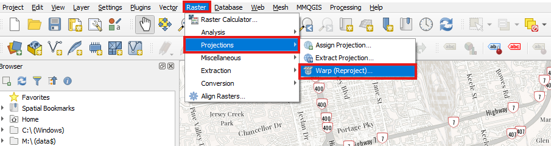

- A new window will pop up where you can select the layer you want to
  reproject from the Input Layer dropdown menu. Select the new CRS
  system you wish to use from the dropdown menu, noting that only
  recently used CRS system are showing.

- For Resampling Method to use, you can leave the default "Nearest
  Neighbor" but if you prefer a different method that works with the
  data you have, you may change it. By default. The layer will be
  temporary unless you specify a file to save it using the three dots in
  a square under Reprojected. Click Run.

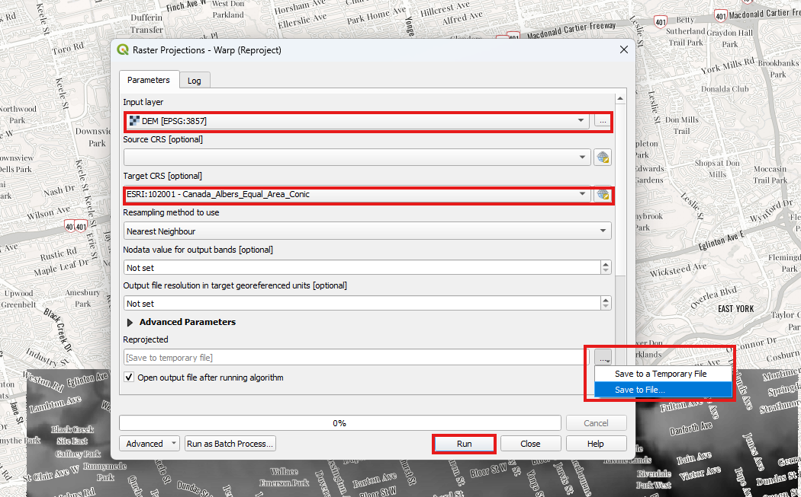

- A new layer will show up with new reprojected data.

### From Toolbox

You can use the Processing Toolbox for reprojecting vectors and
shapefiles, but since we only have raster data here, the results are not
shown.

- From the Main Menu select Processing then click on Toolbox

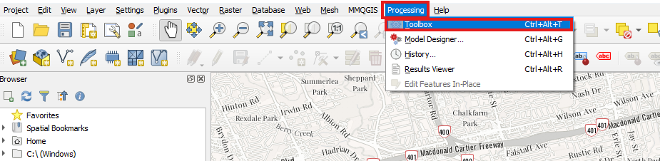

- A new Processing Toolbox pane will show up on the right of the screen.
  In the search bar, write "reproject layer" and click on the matching
  result if you have a victor.

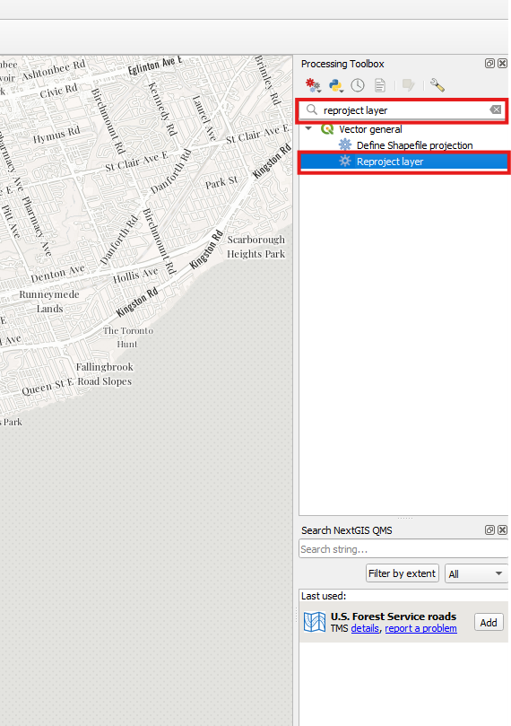

- A Vector General window will pop up to select the layer and new
  projection, then click on run.

### By Exporting Layer

- You can save the layer or export it by right-click the layer and
  select Export -\> Save As

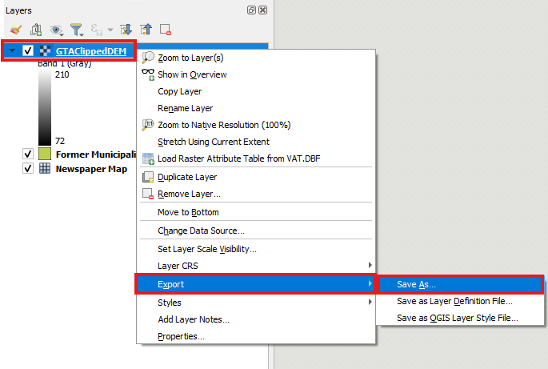

- In the Save As window, click on the three dots next to file name to
  select desired location and name. In the CRS make sure the desired CRS
  projection is selected, or you can change it by selecting from the
  drop-down menu with more option if you click on the projection icon
  next to it. Leave the default option as they are and click OK.

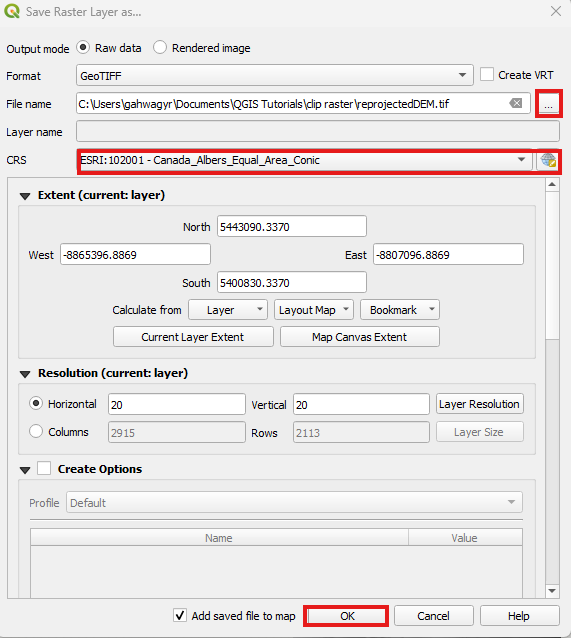

- This is the only way to save the reprojection after closing the project. It is also how to save a layer with any type of data, regardless of
  if you want to reproject it or not.

## Reassigning the Projection

You can also reassign the CRS to your data which does not alter the
original data source in any way but will only change how it is displayed
to you. Here we will go through two main ways to reassign the CRS but
note that this will not truly change the projection unless you export it
since QGIS does "on the fly" projection. These steps could be helpful if
there is missing or incorrect information on a layer's CRS.

### From Main Menu

- Select from the main menu Project -\> Properties\...

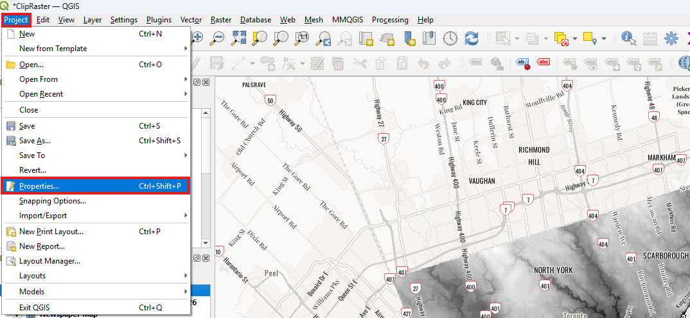

- In the Project Properties window, Select CRS tab. Here you can select
  a projection that will apply to all layers. You can filter or search
  by term. Here we looked for Canada and choose the Canada Atlas Lambert
  and click OK. Another window may show up to select the transformation
  method, click OK.

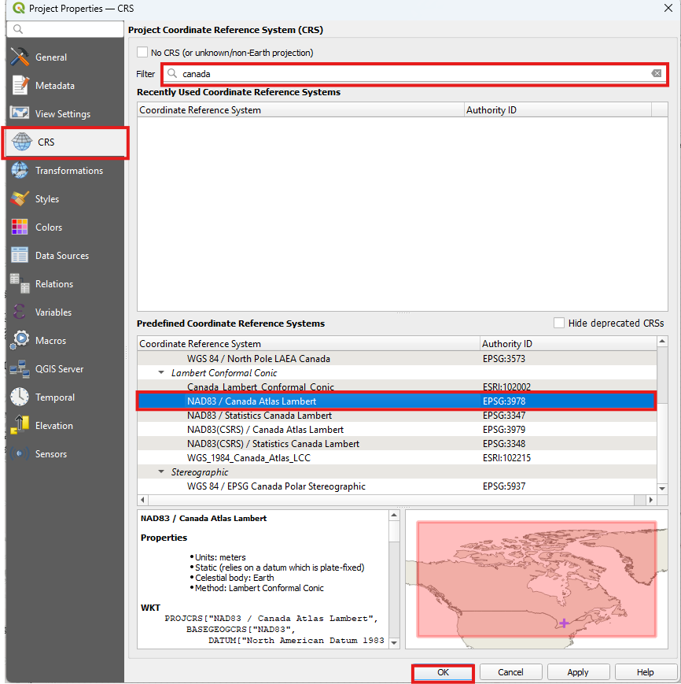

- Important note: This will change the project projection but not the
  single layers. Although, the layers may look like they are in the new
  projections, they may have different CRS

### From Layers Pane

- To change the projection of one layer or multiple layers, then select
  the layers you want to re-project, so they are highlighted in blue.
  Right-click and select Layer CRS -\> Set Layer CRS

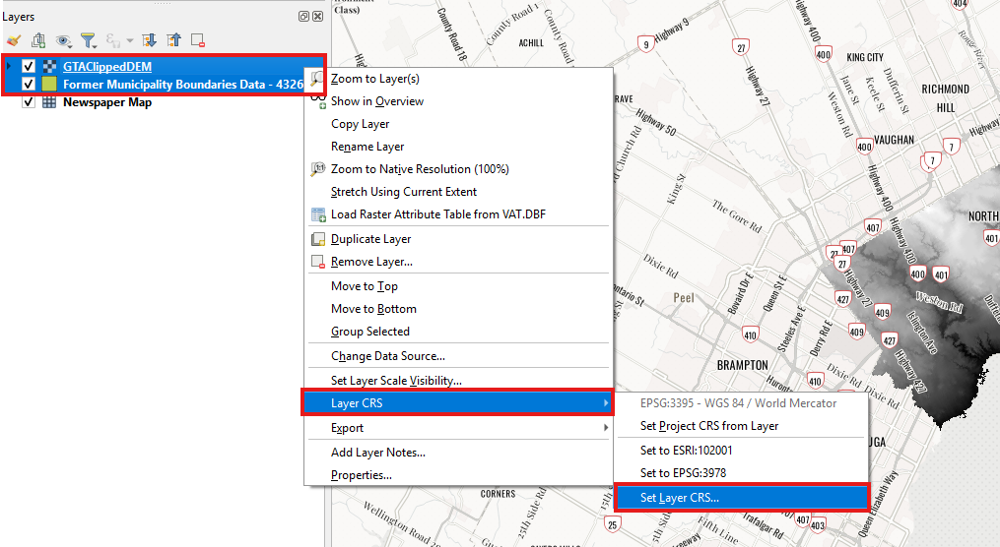

- In the Set CRS window, you can select the desired CRS from recently
  used systems or search for one through the search bar on top. Click OK
  after highlighting the CRS you want.

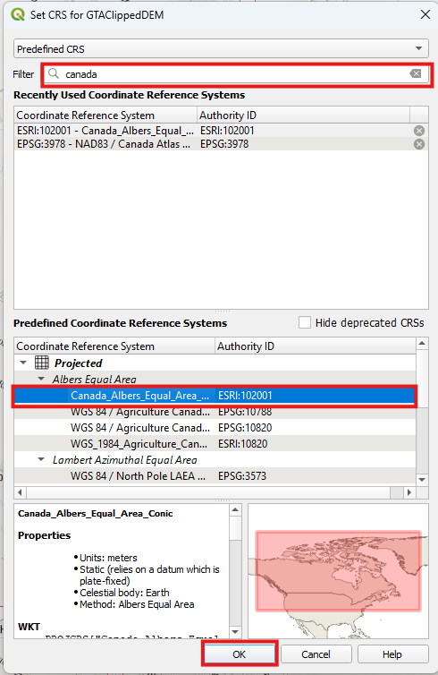